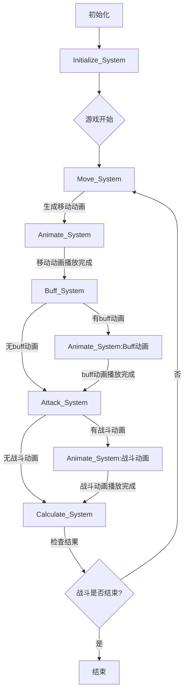
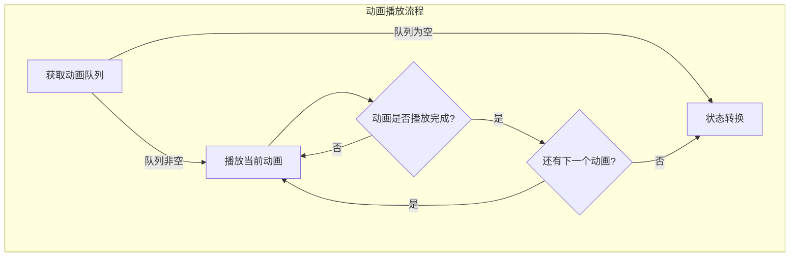
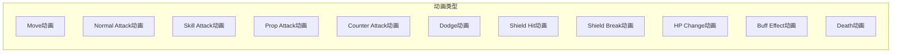
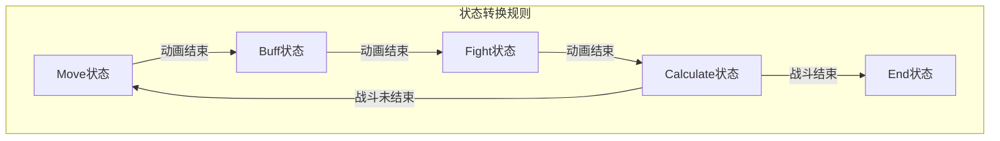

### 主要内容
* 没错，就是``蛋饺梅西``
* 向下的地牢探索，战斗结果是获取怪物身上的有用材料（去做料理）、装备（熟练度增加道具效果，多个装备组合产生效果）、经验（根据携带装备会有对应的技能路线，三选一技能）、无用材料（货币）
* 死亡后所有属性重置，仅保留烹饪技巧、装备熟练度
* 怪物都有弱点的致命打击
* 主玩法是和怪物对战，对战期间可以随时从背包中拿出料理
* 形式是轮流攻击/攻速攻击/攻击后移动速度攻击
* a  bbbb
* 副玩法是搭配对应的材料进行合成（合成达到一定数量增加烹饪技巧），料理 = 材料A + 材料B + 烹饪技巧
* 料理可以作为对应怪物的针对弱点的打击道具，角色的恢复、增强，带错料理进行战斗会增强怪物（增加怪物的二阶变声会得到更强的奖励）

### 实现
##### 1 战斗
- 轮次行动
- 物理攻击（消耗耐久）
- 指定技能索引的技能攻击（消耗mana）
- 道具攻击（消耗库存）
- buff
- 播放战斗动画
- 结算部分

##### 2 系统流程图








###### 系统流程说明：
1. 初始化阶段：
- Initialize_System 初始化所有单位和组件
- 设置初始游戏状态为 MOVE

2. 移动阶段 (Move_System)：
- 计算所有单位的移动
- 生成移动动画数据
- 切换到 ANIMATE 状态播放移动动画
- 设置攻击单位列表

3. Buff阶段 (Buff_System)：
- 处理所有buff效果
- 生成buff动画数据
- 如果有动画，切换到 ANIMATE 状态播放buff动画
- 如无动画直接进入战斗阶段

4. 战斗阶段 (Attack_System)：
- 处理攻击逻辑
- 生成攻击相关动画数据
- 如果有动画，切换到 ANIMATE 状态播放战斗动画
- 如无动画直接进入结算阶段

5. 计算阶段 (Calculate_System):
- 检查战斗结果
- 任意一方单位全部阵亡则切换到 END 状态
- 否则切换到 MOVE 状态继续战斗

6. 动画系统 (Animate_System)：
- 管理和播放所有动画效果
- 动画类型包括：
	- 移动动画
	- 普通攻击动画
	- 技能攻击动画
	- 道具攻击动画
	- 反击动画
	- 闪避动画
	- 护盾受击/破碎动画
	- 生命值变化动画
	- Buff效果动画
	- 死亡动画
- 每个动画都有独立的播放时长
- 动画播放完成后根据前一个状态进行状态转换

7. 状态转换规则：
- MOVE -> ANIMATE -> BUFF
- BUFF -> ANIMATE -> FIGHT
- FIGHT -> ANIMATE -> CALCULATE
- CALCULATE -> MOVE/END

##### 3 合成
- 配方：掉落 + 隐藏
- 当前烹饪等级下合成料理：1）已有配方：材料合成得出指定结果，增加熟练度；2）无配方合成：材料合成得到指定结果，概率得到隐藏配方，增加熟练度


##### 4 战前准备
- 库存整理（背包变化）
- 人物配戴（属性变化）


### 拆解
##### 1 游戏背景
- 游戏开始先准备好背包的物品，生命值消耗完前返回为胜利
- 途中会遭遇怪物，击败可获得掉落奖励
- 途中会遭遇怪物，可逃跑
- 途中每天移动都会扣减生命值（可扩展其他属性，用作san值发挥）
- 向右前进遭遇怪物，可增加地图提供可选方向
- 和怪物对战使用的是料理
- 料理制作可以得到对应武器、道具、技能，只需要获得对应的配方即可，也可以通过自由合成也可得到，其中隐藏的配方只能通过自由合成得到
- 相关实现系统
```
	init（初始化组件） 
		-> move（对应组件移动数据更新） 
		-> attack（判断物理/技能攻击与被物理/技能攻击） 
		-> prop（使用道具更新组件数据） 
		-> calcu（条件更新各个组件的数据） 
		-> ani（对应组件会有对应的动画） 
```

##### 2 怪物
1. 掉落
	- 有用材料（去做料理）
	- 经验（可用于分配人物属性）
	- 无用材料（货币）
2. 造型
	- 和食物相融合
	- 参考美食俘虏
3. 技能
4. 战斗属性
	- 血量
	- 攻击
	- 攻击速度
	- 攻击距离
	- 防御
	- 护盾
	- 闪避
	- 元素属性
	- 元素抗性
	- 暴击攻击
	- 暴击率
	- 反击率
	- 经验
	- 等级
	- 类型

##### 3 角色
1. 战斗属性
	- 血量
	- 攻击
	- 攻击速度
	- 防御
	- 护盾
	- 元素属性
	- 元素抗性
	- 暴击攻击
	- 暴击率
	- 反击率
	- 经验
	- 等级
	- 类型
	- 攻击距离
2. 装备
	- 每最后一击杀怪物增加对应熟练度
	- 穿戴后增加属性
	- 组合装备会激发技能
3. 技能
4. 造型
	- 无用之人
	- 穿戴装备后进行更新
5. 背包
6. 烹饪属性
	- 经验
	- 类型等级
7. 装备属性
	- 经验
	- 等级
	- 类型
	- 攻击速度
	- 攻击距离

##### 4 料理
1. 合成材料
2. 所需烹饪技能等级
3. 合成公式
4. 武器制作
	- 制作的熟练度增加效果
	- 料理的耐久度表示使用次数，用一次少一次
	- 料理分远程和近战，相当于增加了不同的攻击距离的有限次数的普通攻击
5. 道具制作
	- 装备道具增加属性，会出现套装效果
	- 投掷道具造成伤害或者得到增益 Buff/Debuff
6. 技能制作
	- 制作的熟练度增加效果
	- 制作后可得到

##### 5 装备
1. 属性
	- 血量
	- 攻击
	- 防御
	- 护盾
	- 元素属性
	- 元素抗性
	- 暴击攻击
	- 暴击率
	- 反击率
	- 经验
	- 等级
	- 类型
	- 攻击距离
2. 造型
3. 技能

##### 6 技能

##### 7 仓库

##### 8 图鉴
