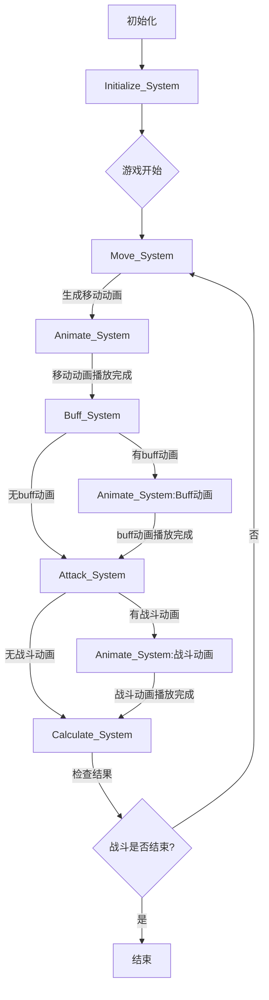
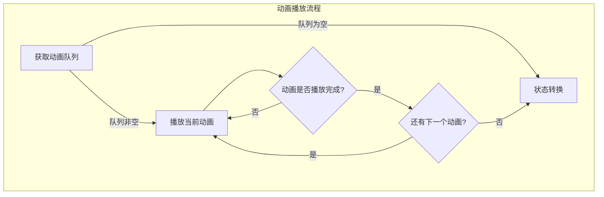
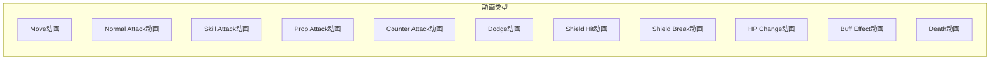
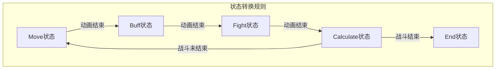

### 主要内容
* 没错，就是``蛋饺梅西``
* 向下的地牢探索，游戏开始先准备好背包的物品，每天都会生命值消耗，通关后或者在生命值消耗完之前返回为胜利
* 死亡后所有属性重置，仅保留烹饪技巧、装备熟练度、技能熟练度
* 怪物都有弱点的致命打击
* 怪物身上掉落：有用材料（去做料理）、装备（熟练度增加道具效果，多个装备组合产生效果）、经验（增加对怪物击杀的熟练度，再次遇到同样的怪物会有伤害加成）、无用材料（货币）
* 主玩法是和怪物对战，对战期间可以随时从背包中拿出料理进行使用
* 主玩法中武器的形式是一个盲盒，从已经拥有的料理列表中随机一个出来？
* 形式是轮流攻击/攻速攻击/攻击后移动速度攻击
* 队形：a  bbbb
* 副玩法是搭配对应的材料进行合成（合成达到一定数量增加烹饪技巧），料理 = 材料A + 材料B + 烹饪技巧
* 料理制作可以得到对应武器、道具、技能，只需要获得对应的配方即可，也可以通过自由合成也可得到，其中隐藏的配方只能通过自由合成得到
	* 作为角色的武器
	* 作为角色的技能觉醒材料，吃掉后获得对应技能
	* 作为角色的状态增益
	* 作为对应怪物的针对弱点的打击道具，对怪物造成直接伤害或者状态减益，带错料理进行战斗会增强怪物（怪物的二阶更为强大，击败后可得到更强更加稀有的奖励）

### 实现
##### 1 战斗
- 轮次行动
- 物理攻击（消耗耐久）
- 指定技能索引的技能攻击（消耗mana）
- 道具攻击（消耗库存）
- buff
- 播放战斗动画
- 结算部分

##### 2 系统流程图

```mermaid
graph TD
	A[初始化] --> B[Initialize_System]
	B --> C{游戏开始}
	
	C --> D[Move_System]
	D -->|生成移动动画| E[Animate_System]
	E -->|移动动画播放完成| F[Buff_System]
	
	F -->|无buff动画| G[Attack_System]
	F -->|有buff动画| H[Animate_System:Buff动画]
	H -->|buff动画播放完成| G
	
	G -->|无战斗动画| K[Calculate_System]
	G -->|有战斗动画| I[Animate_System:战斗动画]
	I -->|战斗动画播放完成| K
	
	K -->|检查结果| L{战斗是否结束?}
	L -->|是| J[结束]
	L -->|否| D
```


```mermaid
graph TD
	subgraph 动画播放流程
		K[获取动画队列] -->|队列为空| L[状态转换]
		K -->|队列非空| M[播放当前动画]
		M --> N{动画是否播放完成?}
		N -->|否| M
		N -->|是| O{还有下一个动画?}
		O -->|是| M
		O -->|否| L
	end
```


```mermaid
graph TD
	subgraph 动画类型
		direction TB
		AA[Move动画]
		AB[Normal Attack动画]
		AC[Skill Attack动画]
		AD[Prop Attack动画]
		AE[Counter Attack动画]
		AF[Dodge动画]
		AG[Shield Hit动画]
		AH[Shield Break动画]
		AI[HP Change动画]
		AJ[Buff Effect动画]
		AK[Death动画]
	end
```


```mermaid
graph TD
	subgraph 状态转换规则
		BA[Move状态] -->|动画结束| BB[Buff状态]
		BB -->|动画结束| BC[Fight状态]
		BC -->|动画结束| BD[Calculate状态]
		BD -->|战斗未结束| BA
		BD -->|战斗结束| BE[End状态]
	end
```

###### 系统流程说明：
1. 初始化阶段：
- Initialize_System 初始化所有单位和组件
- 设置初始游戏状态为 MOVE

2. 移动阶段 (Move_System)：
- 计算所有单位的移动
- 生成移动动画数据
- 切换到 ANIMATE 状态播放移动动画
- 设置攻击单位列表

3. Buff阶段 (Buff_System)：
- 处理所有buff效果
- 生成buff动画数据
- 如果有动画，切换到 ANIMATE 状态播放buff动画
- 如无动画直接进入战斗阶段

4. 战斗阶段 (Attack_System)：
- 处理攻击逻辑
- 生成攻击相关动画数据
- 如果有动画，切换到 ANIMATE 状态播放战斗动画
- 如无动画直接进入结算阶段

5. 计算阶段 (Calculate_System):
- 检查战斗结果
- 任意一方单位全部阵亡则切换到 END 状态
- 否则切换到 MOVE 状态继续战斗

6. 动画系统 (Animate_System)：
- 管理和播放所有动画效果
- 动画类型包括：
	- 移动动画
	- 普通攻击动画
	- 技能攻击动画
	- 道具攻击动画
	- 反击动画
	- 闪避动画
	- 护盾受击/破碎动画
	- 生命值变化动画
	- Buff效果动画
	- 死亡动画
- 每个动画都有独立的播放时长
- 动画播放完成后根据前一个状态进行状态转换

7. 状态转换规则：
- MOVE -> ANIMATE -> BUFF
- BUFF -> ANIMATE -> FIGHT
- FIGHT -> ANIMATE -> CALCULATE
- CALCULATE -> MOVE/END

##### 3 合成
- 配方：掉落 + 隐藏
- 当前烹饪等级下合成料理：1）已有配方：材料合成得出指定结果，增加熟练度；2）无配方合成：材料合成得到指定结果，概率得到隐藏配方，增加熟练度


##### 4 战前准备
- 库存整理（背包变化）
- 人物配戴（属性变化）


### 拆解
##### 1 游戏背景
- 游戏开始先准备好背包的物品，生命值消耗完前返回为胜利
- 途中会遭遇怪物，击败可获得掉落奖励
- 途中会遭遇怪物，可逃跑
- 途中每天移动都会扣减生命值（可扩展其他属性，用作san值发挥）
- 向右前进遭遇怪物，可增加地图提供可选方向
- 和怪物对战使用的是料理
- 料理制作可以得到对应武器、道具、技能，只需要获得对应的配方即可，也可以通过自由合成也可得到，其中隐藏的配方只能通过自由合成得到
- 相关实现系统
```
	init（初始化组件） 
		-> move（对应组件移动数据更新） 
		-> attack（判断物理/技能攻击与被物理/技能攻击） 
		-> prop（使用道具更新组件数据） 
		-> calcu（条件更新各个组件的数据） 
		-> ani（对应组件会有对应的动画） 
```

##### 2 怪物
1. 掉落
	- 有用材料（去做料理）
	- 经验（可用于分配人物属性）
	- 无用材料（货币）
2. 造型
	- 和食物相融合
	- 参考美食俘虏
3. 技能
4. 战斗属性

##### 3 角色
1. 战斗属性
	- 血量
	- 攻击
	- 攻击速度
	- 防御
	- 护盾
	- 元素属性
	- 元素抗性
	- 暴击攻击
	- 暴击率
	- 反击率
	- 经验
	- 等级
	- 类型
	- 攻击距离
2. 装备
	- 每最后一击杀怪物增加对应熟练度
	- 穿戴后增加属性
	- 组合装备会激发技能
3. 技能
4. 造型
	- 无用之人
	- 穿戴装备后进行更新
5. 背包
6. 烹饪属性
	- 经验
	- 类型等级
7. 装备属性
	- 经验
	- 等级
	- 类型
	- 攻击速度
	- 攻击距离

##### 4 料理
1. 合成材料
2. 所需烹饪技能等级
3. 合成公式
4. 武器制作
	- 制作的熟练度增加效果
	- 料理的耐久度表示使用次数，用一次少一次
	- 料理分远程和近战，相当于增加了不同的攻击距离的有限次数的普通攻击
5. 道具制作
	- 装备道具增加属性，会出现套装效果
	- 投掷道具造成伤害或者得到增益 Buff/Debuff
6. 技能制作
	- 制作的熟练度增加效果
	- 制作后可得到

##### 5 装备
1. 属性
2. 造型
3. 技能

##### 6 技能

##### 7 仓库

##### 8 图鉴

##### 9 想要的元素
- 构建骰子，骰子存在6面、8面、12面、20面等
- 合成轮盘更新初始骰子，骰子的每一面代表一种武器或者技能，可以锁定其中N面，根据合成材料出现多个不同的结果，最后随机决定结果（存在正向和负向），作为骰子的其中未锁定面的结果
- 策略培养骰子后进行战斗，战斗前队伍每一个人物携带 2 - 4 个骰子，通过骰子在战斗前决定本次游戏的人物携带的装备和技能
- 进入关卡 -> 行走 -> 遭遇战斗 -> 遭遇事件 -> 进入房间
- 

##### 10 AI 总结生成

以下是为您设计的Roguelike料理主题游戏框架，暂定名 《骰渊回响》《深渊徒步》（Abyss Hiking）：

---
### 整体框架说明
**核心循环**：  
食材收集→料理锻造→地牢挑战→死亡轮回→永久强化  
**核心机制三角**：  
料理（武器/道具）× 食材弱点 × 站位策略  
**特色系统**：  
- 分子料理系统（食材元素组合反应）  
- 炼金术（装备与料理的形态转换）  
- 味觉记忆传承（永久成长体系）  

---
### 1. 游戏技术框架
**架构方案**：  
- 引擎：Godot（轻量级2.5D开发）  
- 核心算法：基于波函数坍缩的地牢生成（WFC算法）  
- 数据架构：分形嵌套的配方数据库（树状图+神经网络）  

**关键技术实现**：  
- **动态料理系统**：  
  - 四维食材属性（酸甜苦鲜）的化学反应模拟  
  - 隐藏配方嗅探系统（根据玩家合成记录预测可能性）  

- **战斗系统**：  
  - 基于时序轴的复合战斗机制（融合回合制与即时要素）  
  - 部位破坏物理引擎（食材怪物的可破坏组件）  （通过提供特定的料理给怪物会暴露弱点部分，期间击杀可获得稀有食材）

- **数据持久化**：  
  - 云纹加密的永久成长存档  
  - 烹饪日志的碎片化保存机制  

**网络特性**：  
- 幽灵系统（可查看其他玩家死亡时的料理组合）  
- 全球料理进度榜（解锁特殊食材的限时事件）  

---
### 2. 美术风格
**核心概念**：  
**可食用恐怖（Edible Horror）** + **厨房朋克**  

**视觉要素**：  
- **怪物设计**：  
  - 食材拟人化（例：  
    - 牛排剑士：带骨肉排构成的中世纪骑士  
    - 海鲜合唱团：章鱼触须组成的管风琴怪物  
    - 蔬菜堡垒：西兰花组成的移动城堡）  
  - 弱点可视化（发光核心+可破坏部位）  

- **场景设计**：  
  - 分层厨房地牢（每层对应烹饪方式）：  
    1F 冷藏库（冰川风格）  
    3F 烤箱地狱（岩浆地形）  
    5F 发酵密室（菌类生态）  
  - 动态环境互动（蒸汽阀门/油脂陷阱）  

- **UI设计**：  
  - 砧板式技能轮盘  
  - 温度计式生命条  
  - 分子料理式状态面板  

**参考风格**：  
《饥荒》的黑暗卡通 + 《料理次元》的食材拟人 + 《Hades》的动态战斗  

---
### 3. 游戏背景设定
**核心世界观**：  
在美食之神陨落的末日，所有料理都异变成"噬食魔物"。玩家作为最后的"味觉传承者"，带着传说中的万能锅具「深渊炖锅」，深入被污染的「最终厨房」寻找净化世界的食谱。

**关键设定**：  
- **地牢真相**：  
  - 每层地牢都是某个文明时代的厨房投影  
  - BOSS战场景为特定料理的文化象征（如饺子龙象征东方饮食文明）  

- **势力体系**：  
  - 酸味联盟（敏捷系）  
  - 甜味教团（魔法系）  
  - 苦味兄弟会（防御系）  
  - 鲜味秘社（召唤系）  

- **核心角色**：  
  - 引路NPC：会进化的智能菜刀「银鳕」  
  - 宿敌角色：黑化料理人「焦烬」（携带碳化武器）  
  - 终极BOSS：吞噬万物的「原始食欲」  

---
### 4. 游戏背景配乐
**声音设计原则**：  
厨具打击乐 + 食材环境音 + 文化饮食旋律  

**分层音效系统**：  
1. **环境层**：  
   - 冷藏库：冰晶碰撞+冷库嗡鸣  
   - 煎烤区：油脂爆裂+铁板滋滋  

2. **战斗层**：  
   - 斩切音效：根据食材硬度变化（蔬菜脆响/肉类闷声）  
   - 必杀技触发：厨具交响乐（炒勺锣响+菜刀剑鸣）  

3. **叙事层**：  
   - 发现隐藏配方：失传民谣片段  
   - BOSS战：饮食文化史诗（寿司之神和声/披萨塔兰泰拉）  

**特色配乐机制**：  
- 实时烹饪音轨：玩家操作速度影响BPM  
- 味觉共鸣系统：特定料理组合触发隐藏BGM  
- 死亡挽歌：根据携带料理生成个性化安魂曲  

---
### 核心系统深化
**「深渊菜谱」系统**：  
- 基础配方：200+（现实料理）  
- 隐藏配方：50+（需特定条件触发，如：  
  - 在海鲜层用火焰武器击杀触发「地狱寿司」  
  - 连续三次失败料理触发「黑暗物质」）  

**「厨具进化」体系**：  
- 炒勺→流星锤（力量系）  
- 擀面杖→长枪（敏捷系）  
- 漏勺→魔法盾（防御系）  

**「食材生态」设定**：  
- 昼夜系统影响怪物属性（昼间面点类/夜间肉类）  
- 怪物互食系统（放任不管会产生进化体）  

**「味觉记忆」传承**：  
- 死亡时记录「最后料理」获得永久抗性  
- 累计死亡次数解锁古神食谱  

---
### 创新设计点
1. **动态难度调味**：  
   - 根据玩家操作习惯自动调整怪物抗性（偏好火攻→出现耐热怪物）  

2. **厨房炼金术**：  
   - 可牺牲装备获得对应料理增益（铁锅→增加防御类料理效果）  

3. **味觉污染机制**：  
   - 携带相克料理会产生负面效果（海鲜+水果→持续中毒）  

4. **终极挑战模式**：  
   - 满汉全席之路（连续挑战108道料理BOSS）  

该设计通过：  
- 将料理的化学变化转化为战斗策略  
- 饮食文化深度融入叙事架构  
- 死亡惩罚与成长的巧妙平衡  
实现「易上手难精通」的Roguelike体验，同时为MOD创作（新增菜系/厨具类型）预留充足空间。


oushi 小游戏（多关卡式）
人物进入场景，然后oushi，玩家通过操作，让人物在规定时间内完成并离开
操作：
- 快速点击屏幕加速
- 拿走手机
- 吃药